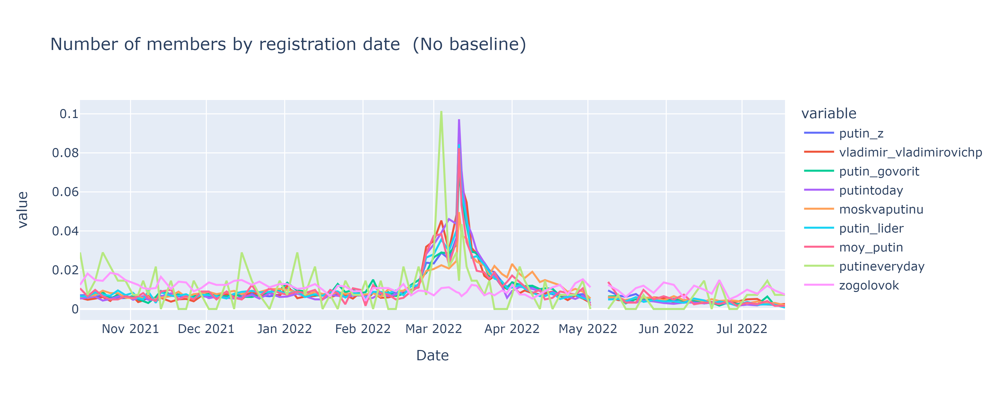
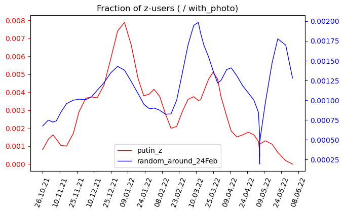

### Dynamics of vk user registration in pro-war groups

Several pro-war VK groups were analyzed. Registration dates of their members were collected, and war-related anomalies in the dates distribution wwere explored.

The results can be found in `results/user_reg_dynamics`.

The workflow can be reproduced by running `user_reg_dynamics.ipynb` in Google Colab. By default, it uses pre-loaded data and doesn't require VK access. The code for re-loading the data from VK is still pressent, but it is likely that API changed since the last run (and an API key is required anyway).

The main finding is a sharp increase in the number of newly registered VK users among the members of pro-war groups, observed after 24 Feb 2022. In the first 2 months of the war, about 3 times more users registered in VK compared to 2 pre-war months. This anomaly was absent in a control group not related to the war.

### Detection of group members with z-avatars

Two sets of VK users were explored:
- Members of a pro-war group "putin_z"
- A random sample of ~300k VK users registered in the period of 10.2021 – 06.2022

For each set, we selected those users who had avatars. Of particular interest were the avatars containing letters Z and V ("Z-avatars"). Registration dates of the users were collected and their temporal distribution was compared between the users with and without Z-avatars.

The results and examples can be found in `results/z_avatars`.

The workflow can be reproduced by running `z_avatar_stats.ipynb` in Google Colab. 

The main finding is that Z-avatars occur in putin_z about 3 times more often compared to the random sample. Both in putin_z and the random sample, registration dates of the users with Z-avatars concentrated around two peaks: one in the late December 2021 and the other - in the first month of the war.

